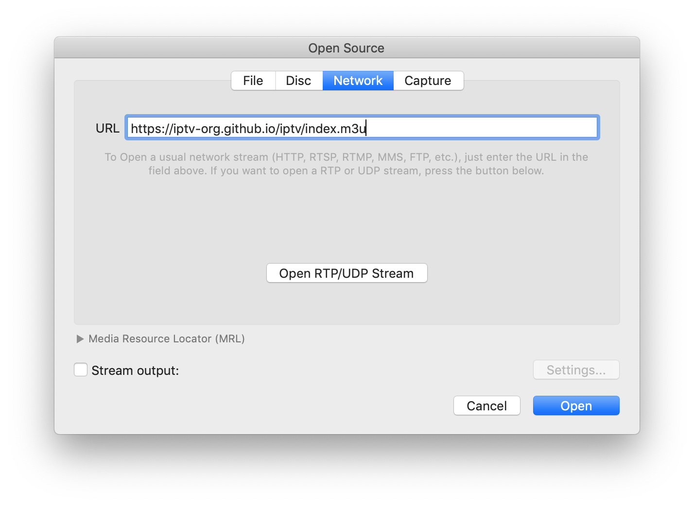

# IPTV

Collection of publicly available IPTV channels from all over the world.

Internet Protocol television (IPTV) is the delivery of television content over Internet Protocol (IP) networks.

## Usage

To watch IPTV you just need to paste this link `https://iptv-org.github.io/iptv/index.m3u` to any player which supports M3U-playlists.

select one of the playlists from the list below.

### Playlists by category

Expand

 

<!-- prettier-ignore -->
<table>
	<thead>
		<tr><th align="left">Category</th><th align="right">Channels</th><th align="left">Playlist</th></tr>
	</thead>
	<tbody>
		<tr><td align="left">Auto</td><td align="right">21</td><td align="left"><code>https://iptv-org.github.io/iptv/categories/auto.m3u</code></td></tr>
		<tr><td align="left">Animation</td><td align="right">21</td><td align="left"><code>https://iptv-org.github.io/iptv/categories/animation.m3u</code></td></tr>
		<tr><td align="left">Business</td><td align="right">65</td><td align="left"><code>https://iptv-org.github.io/iptv/categories/business.m3u</code></td></tr>
		<tr><td align="left">Classic</td><td align="right">71</td><td align="left"><code>https://iptv-org.github.io/iptv/categories/classic.m3u</code></td></tr>
		<tr><td align="left">Comedy</td><td align="right">88</td><td align="left"><code>https://iptv-org.github.io/iptv/categories/comedy.m3u</code></td></tr>
		<tr><td align="left">Cooking</td><td align="right">49</td><td align="left"><code>https://iptv-org.github.io/iptv/categories/cooking.m3u</code></td></tr>
		<tr><td align="left">Culture</td><td align="right">14</td><td align="left"><code>https://iptv-org.github.io/iptv/categories/culture.m3u</code></td></tr>
		<tr><td align="left">Documentary</td><td align="right">59</td><td align="left"><code>https://iptv-org.github.io/iptv/categories/documentary.m3u</code></td></tr>
		<tr><td align="left">Education</td><td align="right">20</td><td align="left"><code>https://iptv-org.github.io/iptv/categories/education.m3u</code></td></tr>
		<tr><td align="left">Entertainment</td><td align="right">208</td><td align="left"><code>https://iptv-org.github.io/iptv/categories/entertainment.m3u</code></td></tr>
		<tr><td align="left">Family</td><td align="right">53</td><td align="left"><code>https://iptv-org.github.io/iptv/categories/family.m3u</code></td></tr>
		<tr><td align="left">General</td><td align="right">307</td><td align="left"><code>https://iptv-org.github.io/iptv/categories/general.m3u</code></td></tr>
		<tr><td align="left">Kids</td><td align="right">201</td><td align="left"><code>https://iptv-org.github.io/iptv/categories/kids.m3u</code></td></tr>
		<tr><td align="left">Legislative</td><td align="right">61</td><td align="left"><code>https://iptv-org.github.io/iptv/categories/legislative.m3u</code></td></tr>
		<tr><td align="left">Lifestyle</td><td align="right">86</td><td align="left"><code>https://iptv-org.github.io/iptv/categories/lifestyle.m3u</code></td></tr>
		<tr><td align="left">Local</td><td align="right">503</td><td align="left"><code>https://iptv-org.github.io/iptv/categories/local.m3u</code></td></tr>
		<tr><td align="left">Movies</td><td align="right">280</td><td align="left"><code>https://iptv-org.github.io/iptv/categories/movies.m3u</code></td></tr>
		<tr><td align="left">Music</td><td align="right">387</td><td align="left"><code>https://iptv-org.github.io/iptv/categories/music.m3u</code></td></tr>
		<tr><td align="left">News</td><td align="right">455</td><td align="left"><code>https://iptv-org.github.io/iptv/categories/news.m3u</code></td></tr>
		<tr><td align="left">Outdoor</td><td align="right">40</td><td align="left"><code>https://iptv-org.github.io/iptv/categories/outdoor.m3u</code></td></tr>
		<tr><td align="left">Relax</td><td align="right">19</td><td align="left"><code>https://iptv-org.github.io/iptv/categories/relax.m3u</code></td></tr>
		<tr><td align="left">Religious</td><td align="right">260</td><td align="left"><code>https://iptv-org.github.io/iptv/categories/religious.m3u</code></td></tr>
		<tr><td align="left">Series</td><td align="right">227</td><td align="left"><code>https://iptv-org.github.io/iptv/categories/series.m3u</code></td></tr>
		<tr><td align="left">Science</td><td align="right">15</td><td align="left"><code>https://iptv-org.github.io/iptv/categories/science.m3u</code></td></tr>
		<tr><td align="left">Shop</td><td align="right">47</td><td align="left"><code>https://iptv-org.github.io/iptv/categories/shop.m3u</code></td></tr>
		<tr><td align="left">Sports</td><td align="right">276</td><td align="left"><code>https://iptv-org.github.io/iptv/categories/sports.m3u</code></td></tr>
		<tr><td align="left">Travel</td><td align="right">21</td><td align="left"><code>https://iptv-org.github.io/iptv/categories/travel.m3u</code></td></tr>
		<tr><td align="left">Weather</td><td align="right">17</td><td align="left"><code>https://iptv-org.github.io/iptv/categories/weather.m3u</code></td></tr>
		<tr><td align="left">XXX</td><td align="right">40</td><td align="left"><code>https://iptv-org.github.io/iptv/categories/xxx.m3u</code></td></tr>
		<tr><td align="left">Other</td><td align="right">4376</td><td align="left"><code>https://iptv-org.github.io/iptv/categories/other.m3u</code></td></tr>
	</tbody>
</table>

## Resources

You can find links to various IPTV related resources in this repository [iptv-org/awesome-iptv](https://github.com/iptv-org/awesome-iptv).

## Legal

No video files are stored in this repository. The repository simply contains user-submitted links to publicly available video stream URLs, which to the best of our knowledge have been intentionally made publicly by the copyright holders. If any links in these playlists infringe on your rights as a copyright holder, they may be removed by sending a pull request or opening an issue. However, note that we have **no control** over the destination of the link, and just removing the link from the playlist will not remove its contents from the web. Note that linking does not directly infringe copyright because no copy is made on the site providing the link, and thus this is **not** a valid reason to send a DMCA notice to GitHub. To remove this content from the web, you should contact the web host that's actually hosting the content (**not** GitHub, nor the maintainers of this repository).
